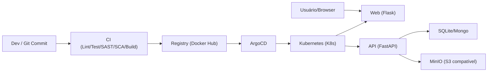
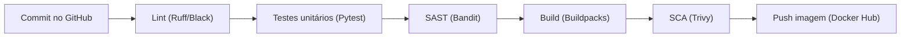
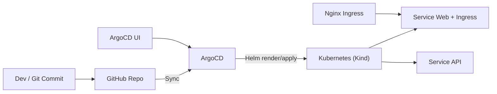

# Lab de Platform Engineering (Monorepo API + Web)

Este repositório é um laboratório prático de **Platform Engineering** e **DevSecOps**. A ideia é evoluir do ciclo de build e segurança (CI) até **GitOps/CD**, IaC, runtime, observabilidade e governança.

## Contexto do Lab
- Monorepo com **API (FastAPI)** e **Web (Flask)**
- **CI** com SAST/SCA, build de imagens via Buildpacks e push para registry
- **CD GitOps** com **Helm + ArgoCD**
- Plataforma local com **Kind + Nginx Ingress**
- Storage local com **MinIO (S3 compatível)** para uploads

## Camadas atuais
- **CI/DevSecOps**: Bandit + Trivy + Buildpacks + push de imagens
- **CD/GitOps**: ArgoCD aplicando Helm Charts do monorepo
- **Plataforma local**: Kind com Nginx Ingress (via `makefile`)
- **Storage local**: MinIO para documentos de carros

## Roadmap (evolução do lab)
- Terraform para provisionar plataforma
- MongoDB Atlas criado via Terraform
- GitOps para Terraform com Terraform Controller
- Pipeline completa de Terraform (plan/apply e validações)
- Policy as Code para Kubernetes e Terraform
- Evolução até Backstage e fluxo completo de Platform Engineering

## Documentação detalhada
- Apps (API + Web): [app/README.md](app/README.md)
- Plataforma (Helm + ArgoCD + Kind): [plataforma/README.md](plataforma/README.md)

## Estrutura do repositório

```text
.
├── .github/workflows/         # Pipelines CI (API e Web)
├── app/
│   ├── api/                   # API FastAPI
│   └── web/                   # Web Flask
├── gitops/
│   ├── app/                   # Helm chart da API
│   ├── web/                   # Helm chart da Web
│   └── storage-s3/            # Instância unificada S3 + IRSA (claims)
├── plataforma/
│   ├── argo/                  # Application + Ingress do ArgoCD
│   ├── cluster-metadata/      # External Secrets de metadados do cluster
│   ├── crossplane/            # Base + XRD + Compositions
│   ├── helm-charts/           # Charts base reutilizáveis
│   ├── minio/                 # MinIO local (S3 compatível)
│   └── bootstrap/             # Terraform bootstrap EKS
├── kind-config.yaml           # Cluster Kind com portas 80/443
├── makefile                   # Setup local (Kind, Nginx, ArgoCD)
└── README.md
```

## Visão geral do lab

Fluxo de ponta a ponta: commit → CI → registry → ArgoCD → cluster → apps.




## CI/CD (resumo)
O CI roda por pasta (`app/api/**` e `app/web/**`) com **Ruff/Black**, **Pytest**, Bandit, Trivy e Buildpacks. O CD usa ArgoCD para aplicar `plataforma/argo/application-kind.yaml` (via `make bootstrap-argo`) e sincronizar os Helm charts em `gitops/`.

## Esteira CI (visão rápida)
Implementação: `.github/workflows/python-app-template.yml`.



## Pipelines reutilizáveis (como fizemos no lab)
- Criamos um workflow reutilizável em `.github/workflows/python-app-template.yml`
- `api-pipeline.yml` e `web-pipeline.yml` apenas chamam esse template passando `app_path` e `image_name`
- Isso reduz duplicação e facilita manutenção no monorepo
- Em produção, é comum separar repositórios e usar **pipelines padrões da companhia** (templates corporativos) por time/serviço
  - O build publica tags `latest`, `v<run_number>` e `sha-<commit>` e imprime o digest da imagem

## Itens de CI (explicações rápidas)

### Conceitos de segurança
- **SAST (Static Application Security Testing)**: análise do código-fonte sem executar a aplicação; identifica padrões inseguros cedo no ciclo de desenvolvimento. Ajuda a prevenir falhas de segurança antes do build e do deploy.
- **SCA (Software Composition Analysis)**: análise de dependências para detectar vulnerabilidades conhecidas em bibliotecas e pacotes. É essencial para lidar com risco de supply chain e CVEs em terceiros.
- **Bandit**: ferramenta de SAST para Python; procura problemas comuns no código (ex.: binds inseguros, uso perigoso de funções). É rápida e adequada para rodar em todo pipeline.
- **Trivy**: scanner de SCA e de imagens de container; detecta CVEs em dependências e camadas de imagem. Também valida vulnerabilidades do sistema operacional da imagem.

### Qualidade de código
- **Lint**: análise estática para identificar erros, padrões ruins e inconsistências antes da execução; ajuda a falhar cedo no CI. Reduz retrabalho ao detectar problemas simples rapidamente.
- **Ruff**: linter rápido para Python; cobre erros comuns (ex.: imports não usados) e regras de estilo. É indicado para rodar em PRs por ser rápido e preciso.
- **Black**: formatador automático de Python que padroniza o estilo e evita discussões de formatação em PRs. Mantém o código consistente em todo o monorepo.
- **Testes unitários**: validam funções/módulos isoladamente, com dependências simuladas (mocks), para feedback rápido. Ajudam a isolar regressões sem depender de infraestrutura.
- **Pytest**: framework de testes em Python; organiza suites, facilita fixtures e gera relatórios legíveis. Permite escrever testes simples e escaláveis com pouco boilerplate.


## Arquitetura CD (visão rápida)



## Itens de CD (explicações rápidas)
- **GitOps**: CD guiado por Git; o cluster aplica o estado desejado a partir do repositório e o Git vira fonte da verdade. Isso simplifica auditoria e rollback.
- **Buildpacks**: geram imagens OCI sem Dockerfile; detectam stack e dependências automaticamente e padronizam build. Diminuem a necessidade de manter Dockerfiles para cada app.
- **Helm Charts**: templates de Kubernetes; `values.yaml` parametriza ambientes sem duplicar manifestos. Facilita reuso e versionamento de deploys.
- **Probes (readiness/liveness)**: readiness controla quando o serviço recebe tráfego; liveness reinicia containers travados. Configurações corretas evitam indisponibilidade e loops de restart.
- **Imutabilidade de imagens**: tags por SHA e digests garantem rastreabilidade e releases reproduzíveis. Ajuda a identificar exatamente o que foi para produção.

## Decisões de monorepo (e trade-offs)
- **Pipelines por pasta**: API e Web têm workflows separados, mas vivem no mesmo repositório; isso simplifica o laboratório, porém em produção pode virar múltiplos repositórios para isolar ciclos de release.
- **Charts com dependência local**: usamos `file://` e vendorizamos `charts/*.tgz` no repo para facilitar o GitOps; em produção preferimos publicar o chart base em um repositório Helm.
- **ArgoCD com `sources` múltiplos**: uma única Application gerencia API e Web; em produção pode ser interessante separar Applications por serviço.

## Como rodar localmente (atalho)
- Plataforma/cluster: `make all-kind` (ver detalhes em `plataforma/README.md`)
- Plataforma na AWS/EKS: `make all-eks`
- Apps localmente: ver `app/README.md`

## Makefile (comandos principais)
O `makefile` padroniza o setup da plataforma local (Kind) e da plataforma AWS (EKS), incluindo bootstrap de Terraform state e configuração de contexto Kubernetes.
- `make setup` instala Docker/Kubectl/Kind/Helm
- `make all-kind` cria cluster Kind + ingress + ArgoCD + bootstrap GitOps
- `make cluster-kind` cria o cluster Kind (usa `kind-config.yaml`)
- `make install-nginx-kind` instala o Nginx Ingress no Kind
- `make all-eks` executa fluxo EKS completo (bucket state, Terraform, kubecontext, ingress e ArgoCD)
- `make tf-backend-bootstrap` cria o bucket S3 do Terraform state (`tfstate-terraform-lab-plataform-engineering-1`)
- `make cluster-eks` roda `terraform init/apply` em `plataforma/bootstrap` e atualiza o `kubeconfig`
- Backend do Terraform no bootstrap usa lock nativo em S3 (`use_lockfile = true`, sem DynamoDB)
- `make install-argo` instala o ArgoCD
- `make bootstrap-argo` aplica Application e Ingress do ArgoCD
- `make down` remove o cluster
- `make down-eks` remove cluster EKS + node group via AWS CLI

## Observações importantes
- Os charts de `gitops/app` e `gitops/web` usam o chart base `plataforma/helm-charts/app-template` como dependência.
- Sempre que o chart base muda, é necessário rodar:
  - `helm dependency build gitops/app`
  - `helm dependency build gitops/web`
  - Commitar `Chart.lock` e `charts/*.tgz`

## Links rápidos
- App docs: `app/README.md`
- Docs da plataforma: `plataforma/README.md`
